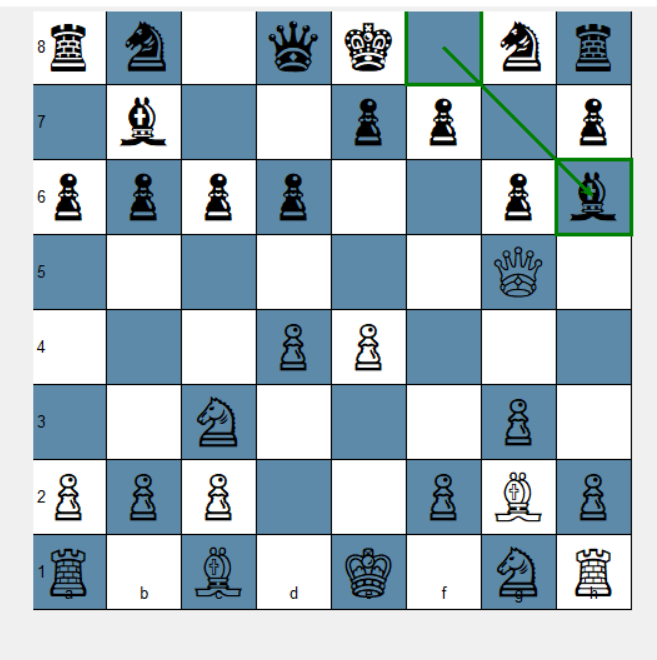

# Chess Engine in Python

A chess engine built from scratch in Python, featuring move generation, position evaluation, and a graphical user interface.



## Overview

This project implements a complete chess engine in Python with the following features:
- Legal chess move generation
- Position evaluation
- Search algorithms (Minimax with Alpha-Beta pruning)
- Simple AI opponent
- Graphical user interface for gameplay

## Installation

Clone this repository:
```bash
git clone https://github.com/SachinSSh/Chess_Engine_in_python.git
```

## Usage

### Running with GUI

To start the chess engine with the graphical interface:

```bash
python -m Chess_Engine_in_python.main --gui
```


## Future Improvements

- Implement transposition tables for improved search performance
- Add opening book support
- Implement UCI protocol for compatibility with chess GUIs
- Improve evaluation function with more chess knowledge
- Add time controls and game clock
hbhb
